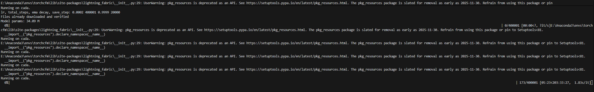

# Flow Matching学习笔记

<!-- [tag]: Paper、Generation、Flow Matching -->

<!-- [description]: 生成方法的数学工具之一Flow Matching学习 -->

[参考知乎](https://zhuanlan.zhihu.com/p/4116861550)
[论文](https://arxiv.org/abs/2210.02747)

## Introduction

在生成式模型使用的方法中，通常把数据视作一个空间上的采样，该采样满足某种分布，通过加噪去噪（这里噪声是噪声分布，通常使用高斯分布）来实现规则的数据与无序噪声的相互转化，这是目前比较通用的**扩散模型**的做法。

**Flow Matching**同样也是基于分布到分布的基本思想，但是转化过程中所使用的数学工具有所不同，它从一个分布出发，叠加上对速度场函数的积分，得到一个新的分布。

算法涉及的位移-速度-时间公式用一个常微分方程（单一自变量）表示：

$$
\frac{dx}{dt}=u_t(x) \tag{1}
$$

当然也可写作：

$$
dx=u_t(x)dt \tag{2}
$$

其中 $u_t(x)$ 是一个随时间变化的速度场，因为是场所以与位置 $x$ 相关，随时间变化所以与时间 $t$ 相关，也可以写作 $u(t,x)$ 这样一个函数。$x$ 是值域空间上的采样，$t$ 由0到1。该函数值域规定：$u(t,x):[0,1] × R^d\rightarrow R^d$。

如果用函数 $\psi_t(x)$ 表示 $x$ 在0~1任意时刻下的位置（该函数又被称作速度场），那么(1)(2)式又可以写成：

$$
\frac{d}{dt}\psi_t(x)=u_t(\psi_t(x)) \tag{3}
$$

数据是从分布上的一个采样，从**分布**的角度来考虑，(2)速度场影响下的从一个 $t=0$ 时的概率分布到另一个 $t=1$ 时的概率分布的公式：

$$
\frac{\partial p}{\partial t} = -\nabla · (p_tu_t) \tag{4}
$$

理解完散度和连续性方程我们再看回来这个式子，$p_tu_t$ 是概率流密度，可以理解为：$概率密度随时间变化 = -流量散度$。

### 补充知识(散度、连续性方程)

散度可以写作:

$$
\nabla·v=\sum_{i=1}^{d} \frac{\partial v_i}{\partial x_i} \tag{5}
$$

这是一个标量，表示不同方向求偏导的和。这是一个标量，大于0表示向外发散，小于0表示向内收敛，=0表示体积保持不变。

连续性方程则是物理意义上运用比较广泛的工具，守恒量不会突然消失或增加，只会从一个位置转移到另一个位置，所以依赖一个通用的方程。一般的连续性方程写作：

$$
\frac{\partial p}{\partial t} + \nabla · f = s \tag{6}
$$

s是生成量，如果是守恒量s这一项为0，就得到我们上面用到的：

$$
\frac{\partial p}{\partial t} + \nabla · f = 0 \tag{7}
$$

物理意义上就是：**在任意区域内某种守恒量总量的改变，等于从边界进入或离去的数量**。

## Algorithm

此处很多数学工具被用作推导证明一些性质，目前笔者只停留在感性理解的阶段，待数学基础进一步扎实后再进行补充。

上面很显然我们可以发现，求解函数 $u_t(x)$ 是这个生成任务方法中关键的一步。

Flow Matching所做的就是拟合这个函数采用的是类似Score Matching的思想。

原文作者在此处有两个假设：

1. 第一个转化首先考虑用网络去拟合一个速度场函数，损失函数 $L_{FM}(θ):=\mathbb{E}_{t,x \sim p_t}\|v_\theta(t,x) - u_t(x)\|^2$，$θ$ 是神经网络的参数，$\mathbb{E}$ 是期望，但实际情况 $u_t(x)$ 较难采样，因为无法获得它的表达式包括采样分布。$$\nabla L_{FM}(θ) = \nabla L_{CFM}(θ) \tag{8}$$ 这里作者构造了一个条件分布，这个条件分布的形式和推到就不写了，最后可以得到一个近似等价（CFM，Conditonal Flow Matching）：这意味着我们可以优化右式的θ从而达到优化左式θ的效果。

2. 假设了一个隐变量（条件分布中的条件）$x1$，假设 $x1$ 服从高斯分布，这个隐变量分布也可以看作是一种概率路径的形式，可以推导出 $u_t(x)$ 的表达式。假设概率路径为线性（直线），那么用线性插值来推导，可以得到非常简单的关于 $x$ 的分布和 $u_t(x)$ 。

## Code & Application

可能结合代码更好理解一点，所以接下来将跑一跑实验以及看看代码
开源代码在 [Github](https://github.com/atong01/conditional-flow-matching) 上，暂时在本机3060Ti 8G上跑cifar-10数据集（一个包含鸟、车等等的单物品图片的数据集）上的生成任务，跑这个demo大概要4个小时的时间。

