# 点云上采样

<!-- [tag]: Paper、3D Reconstruction、Upsampling -->

<!-- [description]: 点云上采样 -->

## [CVPR2024]RepKPU: point cloud upsampling with kernel point representation and deformation

### 动机

目前点云上采样有两种做法：generation-based/refinement-based。生成：提特征 -> 回归xyz，坐标会出现异常值(outliers or shrinkage artifact)，**回归难度大**。细化/微调：粗生成：简单插值 -> 提特征 -> 从特征生成点然后基于**距离函数**微调点坐标。

#### 距离函数

SDF 和 UDF 都是常见的距离函数，用以表示点到表面的距离，常用于重建/表面补全等等的任务。

SDF 是有符号距离函数，用以表示点在物体表面内部还是外部，距离表面多远。UDF 为有符号距离函数，用以表示点距离表面的距离。SDF 一般使用在封闭表面场景，如球面，飞机等等这类数据。UDF 携带信息更少，但是更易计算更方便使用，且对开放表面和非水密（watertight）点云更友好。

有的点云上采样方法会通过上述距离场来修正生成的点，但**从稀疏的点云里去学习这个距离场较为困难**。

### 方法

这篇工作提出了一种Kernel-to-Displacement的方法，优化形状表示和点云生成策略。
采用类似KPConv的方法。

#### KPConv

1. 对于一个中心点，用类似knn或者ball query来找邻域点
2. 然后在中心点附近放一组kernel points（类似2d图像里的卷积核，这里起到的是3d空间上的卷积核的作用）
3. 然后找到距离每个kernel point距离近的点，通过距离加权算贡献，得到在这个kernel point上产生的特征
4. 最后再聚合得到这个中心点的特征

这个工作参照KPConv设计了一个**RepKPoints**（kernel point representation）：
每个输入点，在以它为球心半径为r_k的球面上均匀采一组kernel points，然后用输入点邻域的点特征去预测每个kernel point的offset，把这个offset叠加上去得到这个输入点的RepKPoints，用来表示局部形状。
以及**KP Queries**(kernel point queries)

#### 网络Pipeline

1. 输入是 $N*3$ 的点云，逐点encoder出C_e长度的特征 $N*C_e$。
2. 每个输入点先**提取M个RepKPoints**：
    1. 每个输入点通过ball query找到n个邻域点，拿到 $n*3$ 的点坐标和 $n*C_e$ 的特征
    2. $n*C_e$ 做共享权重MLP得到 $n*C_k$
    3. init M个kernel Point（工作中设置为15），每个kernel Point跟n个邻域点坐标计算距离d，距离用来加权，加权函数 $max(0, 1 - d / σ)$
    4. 用这个权重去做特征的聚合，每个kernel point将 $n*C_k$ 加权相加得到它对应的长度为C_k的特征向量，M个kernel point即 $M*C_k$
    5. 对每个kernel point的特征再做一个维度变换，即 $M*C_k$ 经过一个权重矩阵 $W_Δ: M × C_k × C_out$ 后得到 $M*C_out$
    6. $M*C_out$ 相加得到长度为 $C_out$ 的 $f_Δ$
    7. 再用 $f_Δ$ 经过MLP之后得到 $M*3$ 的 $Δ_k$，这个是每个kernel point的3d offset，叠加在 init的kernel point坐标上得到RepKPoints的空间坐标。
3. 得到RepKPoints后，用新坐标跟邻域点做特征加权聚合，得到一份新的 $F_p: M*C_k$，然后乘一个可学习矩阵 $M*C_k*C_k$ 然后把特征聚合（求和），得到一个 $C_k$ 长度的特征向量，作为这个点这个局部的特征 $f_g$，concat到 $F_p: M*C_k$ 上得到 $M*2C_k$，再过一个MLP得到最终的RepKPoints特征 $F_k: M*C_k$
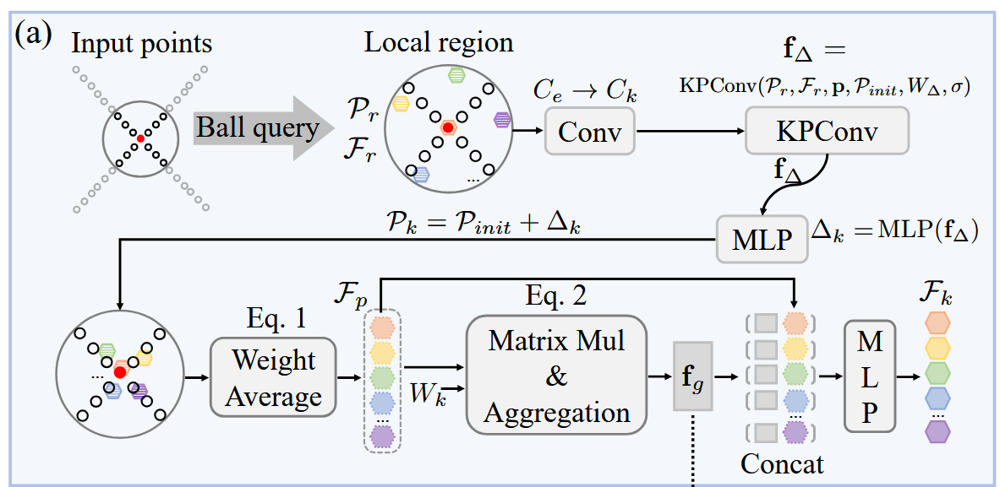
4. 第3步得到了两个特征：一个是每个输入点的局部邻域特征 $f_g$ （N个输入点， $F_g=N*C_k$ ），一个是每个输入点对应的RepKPoints的特征 $F_k$，接下来**准备建立KP Queries**，每个输入点r个query，r是上采样倍率：
    1. 初始化是在球面上均匀采r个点
    2. 依旧先ball query找邻域，然后距离加权更新KP Query的特征，得到 $F_{p'} = r * C_k$
    3. 跟上一步的矩阵乘并聚合很像，就是乘一个新的权重矩阵然后出一个 $f_{g'} = 1 * C_k$ 的特征向量，$f_g$ 和 $f_{g'}$ 两个拼上刚刚的 $F_{p'}$ 得到 $r*3C_k$ 的特征然后过一个MLP得到KP Queries的特征向量 $F_q$

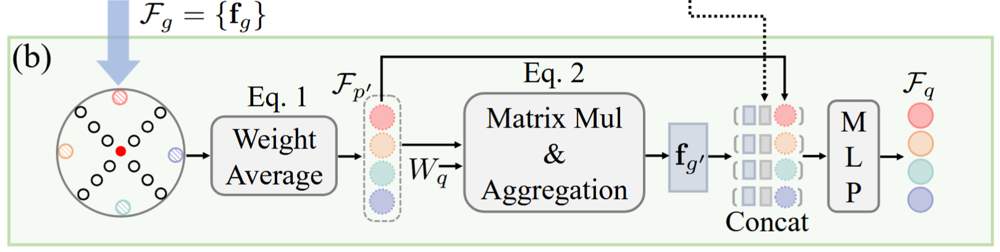
5. 现在获得了RepKPoints的特征矩阵 $N*M*C_k$，以及KP Queries的特征矩阵 $N*r*C_k$，接着做**cross attention**，用KP Queries的特征做查询，RepKPoints的特征做key和value。这里会做一次维度变换计算，但是计算前后维度不变，C_k = C_d = 128，经过三层[cross attention + MLP]最终得到displacement 的特征矩阵 F_d
6. 最后经过一个MLP将 $N*r*C_k$ 变换为 $N*r$ 个坐标
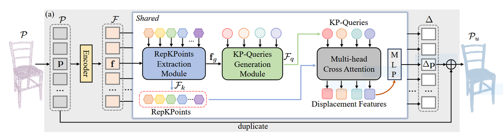

#### 监督信号

这份工作的监督信号主要分为三个部分：
$$L = L_{cd} + L_{fit} + L_{rep}$$
L_cd是双向chamfer distance，直接用gt点云和预测坐标计算
后两项主要用来约束KPConv环节中的3d offset的预测，这两项不需要直接的GT，作用是：L_rep防止点聚在一块，L_fit：使预测的RepKPoints靠近某个局部邻域点。

### 实验评估

PU-GAN dataset，点云上采样里很常见的 benchmark
PU1K dataset
这篇工作最后指标用了3个：

1. CD：Chamfer Distance
2. HD：Hausdorff Distance（最大的最近邻距离，最坏的离群点）
3. P2F：Point-to-Surface Distance（在我们这个任务里可能可以改成到边缘曲线的距离？）

如果做边缘上的上采样的话，可能需要增加额外的指标来对比效果，还要考虑GT的范围

## [CVPR2023]Grad-PU: arbitrary-scale point cloud upsampling via gradient descent with learned distance functions

### 动机

1. 由于特征提取->特征expansion->3D坐标回归的pipeline，单次训练只能做一个固定的上采样倍率。更换上采样倍率就要重新训练。
2. 直接3D坐标预测较为困难，常有异常值和收缩伪影(**outliers or shrinkage artifact**)

### 方法

整体的思路是：对任意上采样倍率，先按照这个倍率做插值，然后用训练网络来微调插值出来的坐标。

#### 插值

输入是稀疏输入，对每个输入点：kNN得到k个近邻点，然后直接每个近邻点和这个输入点取中点，在k个点中FPS中选出r个点，r是上采样倍率。

#### 微调

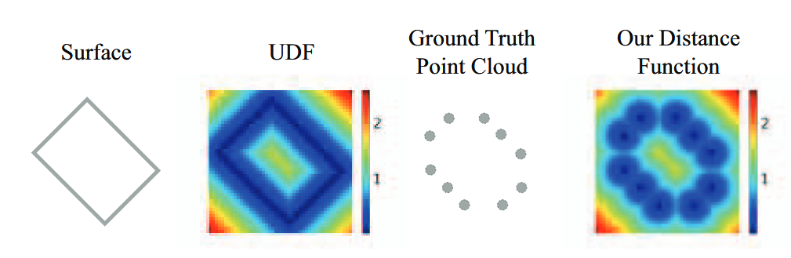
这篇工作里觉得UDF和SDF很难从低质量的点云中得到，所以用了一个点到点距离：其实就是单向chamfer distance，**输入点离最近的GT的距离**。这里网络训练的目的是能预测出第四张图这个距离场，这个距离场是可微的。然后在跑测试预测的时候，用这个距离场通过梯度下降的方式去更新采样点的坐标，让采样点逐步靠近这个距离的局部最小值（论文里迭代次数=10）（**这里有个弊端，虽然在初始化候选采样点时用了FPS拉开了距离，但是只通过这个距离场很有可能会出现多个点经过梯度下降后聚拢到一块**）。这个做法确实可以arbitrary upsampling rates，因为是每个点独立进去一个shared的距离场做梯度下降，点数并不会影响什么，只会影响计算量。

#### 网络
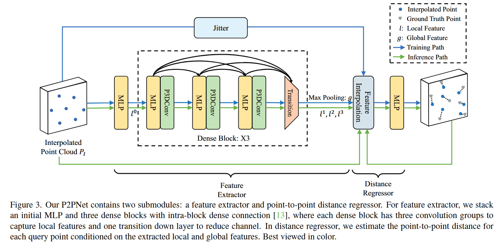

1. 先插值点云
2. 然后用MLP提取出特征l0
3. 然后主要讲dense block这部分，每个block先经过一次MLP，然后P3DConv部分：
    1. 每个点k近邻得到k个近邻点，做距离差
    2. 距离差经过MLP得到权重，写作 $α$ (距离差)，近邻点特征经过MLP得到 $β(feat)$ ，两者相乘再经过一次MLP( $γ$ )得到该点新的特征
    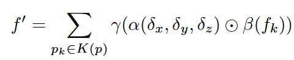
    3. 每一个block的输入会拿到先前不同层级的特征，第一个block输入是l0，第二个block输入是concat(l0,l1)，第三个block输入是concat(l0,l1,l2)，确实不同层级**感受野不同**
    4. 最后transition把concat(l0,l1,l2,l3)特征维度4d->d
    5. 因为查询点不一定刚好落在插值后的点云位置上，所以对于任意一个xyz坐标，都要能得到特则特征，所以需要**对特征插值**：
        1. 对一个query point p，在初始插值点云 PI 里找 3 个最近邻；
        2. 用距离倒数作为权重；
        3. 对这 3 个邻居的特征做加权平均。
    6. 最后max pooling得到一个全局特征g，然后将点云坐标p,g,l0,l1,l2,l3输入到MLP中训练这个距离场函数或者用以预测
    7. 然后需要补充的是，为了让模型学到的范围更大，训练时有一个**jitter操作**，将初始的插值点云加上一个高斯噪声扰动，插值出新特征，然后再喂给最后的距离场MLP再进行一次训练
4. 预测的时候就是用训练好的距离场，查询点p->插值提feature->MLP算距离d->d对查询点坐标p求梯度->按照梯度修正点坐标p->迭代T=10次后得到最终上采样点

### 延伸

如果任务重心偏向于边缘的话，感觉这个距离场可以改出一个**加权距离场**，如果查询点离边缘点更近，那么可以乘一个<1的权重，让这个距离场的梯度沿着向边缘的地方下降

### 实验评估

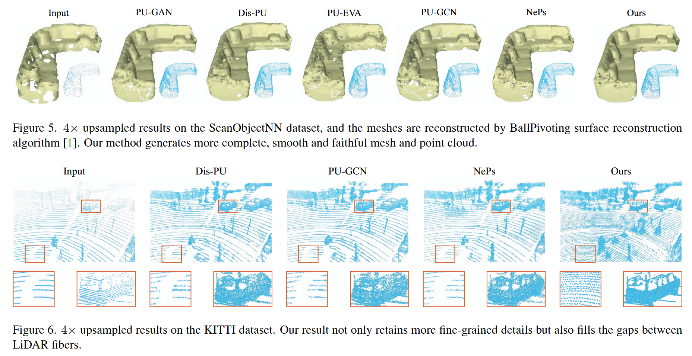
作者还用在PU-GAN数据集上训练的模型在ScanObjectNN和KITTI两个真实场景扫描数据集上做了测试，但是这两个数据集没有high-res GT，所以只能肉眼看效果。

## [2024预印]EGP3D: Edge-guided Geometric Preserving 3D Point Cloud Super-resolution for RGB-D camera

这篇工作就略显粗糙了，所以我也没看太细，它做的是RGBD相机的点云增强，用RGB图像来增强，首先他的**点云和rgb图像就已经对齐了**，所以可以把点云反投影回RGB图像上。整体的流程是先上采样，把上采样点投影到RGB图像上通过图像canny来修正这个坐标。
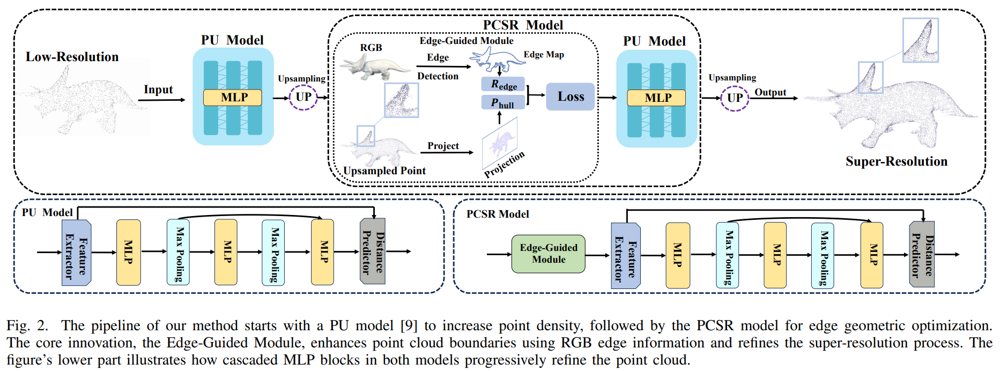
用的自己做的数据集，然后跟sota比就是直接用sota模型输入点云跑。
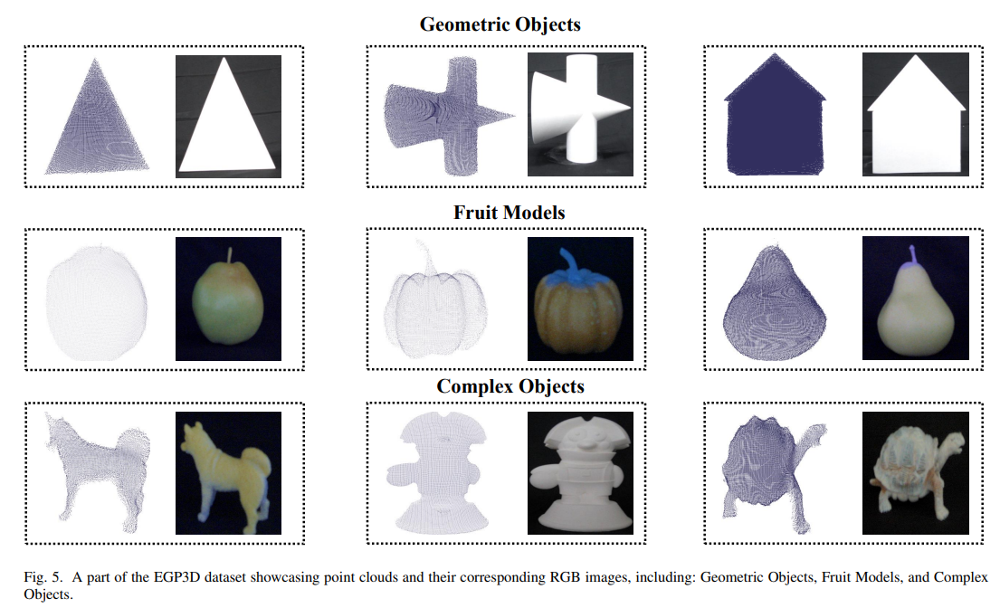
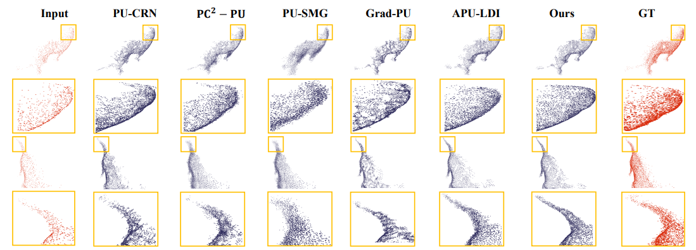

## [2018CVPR]PU-net: point cloud upsampling network

上采样任务比较开山的端到端方法

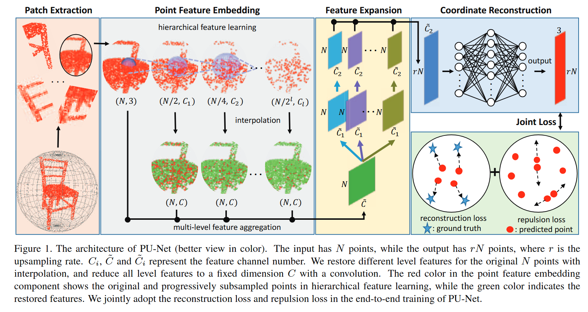

是分patch的方法，先把输入点云 $N * C$ 分patch：

1. FPS找中心点
2. 每个中心点kNN取邻域点构成patch，这里每个patch是可能会有重叠的，所有patch总点数不等于（一般大于）输入点数，所以在测试时需要采样回 $N * r$ 个点
3. 取完patch后回做归一化，patch中心点作为坐标系原点，除以patch半径把坐标收缩到(-1, 1)

提特征是类似pointnet的方法，多尺度特征提取：

1. 每个点knn找k个邻域点，算相对坐标，用MLP获得特征，maxpooling压缩成一个特征向量作为这个点的局部特征向量
2. 采样上一层N/2的点，继续在上一步的特征上做，让特征获得更大的感受野，Grad-PU的多尺度特征也是类似的，只不过那个工作里聚合的方法是**计算权重加权邻域特征相加**。
3. 深层的点特征通过插值传播回去，每个点就可以拥有多尺度的特征向量，最后concat成一个特征向量

特征扩充，r倍上采样就把 $N * c$ 特征扩充成 $rN * c'$：

1. 设计了r个特征扩充网络，每个网络将 c 变成 c'
2. 拼起来得到 rN * c'

最后MLP得到预测的点坐标，loss使用的是**EMD loss**(Earth Mover’s Distance,预测和GT算一个最优的一一匹配，让匹配对的点的距离和最小)和repulsion loss，repulsion loss在RepKPU里也有用到：每个点knn找相邻点，然后算之间的距离取反后加权，求和这个值越大惩罚越大，防止点聚在一起

## [ECCV22018]EC-Net: an Edge-aware Point set Consolidation Network

同样是按patch来做。

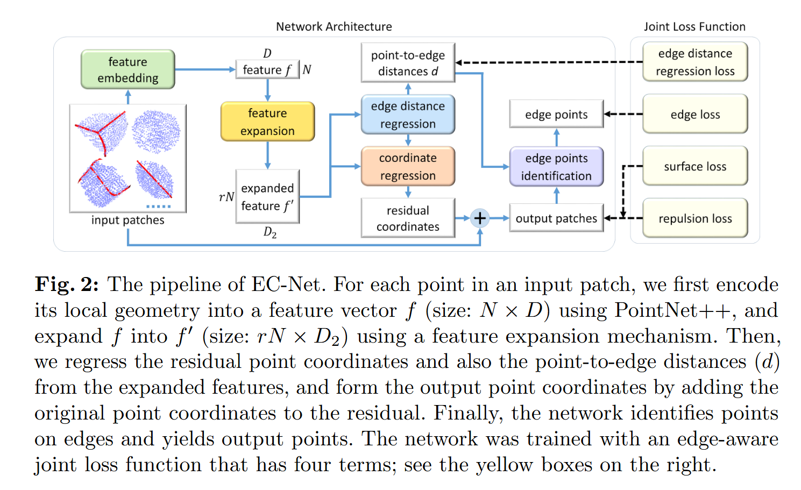

分patch这一步有一些区别：

1. 不再是knn直接分patch，而是先knn建边建出来一个图，然后每个中心点取最近的图上距离的k个点。这样的话patch中点的选取会更倾向于在表面上扩散选择，而不是直接一个球形范围。
2. 然后设置了一个β，最后采样总点数是 $β * N$ 个点，patch数量是 $β * N / patch\_ size$，这样可以保证每个patch之间有重叠。
3. 然后每个patch保留靠近中心的一半点，这样每个点都有完整的邻域信息。

对点云特征提取和特征expansion的方法跟PU-Net是基本一致的。

加了一个**edge distance regression**，用上一步的特征回归每个点距离最近的sharp edge的距离d。

将这个距离拼接到expansion后的feature上，经过两个全连接层回归坐标。

用回归的这个d来预测每个点是否是边缘点，小于设定的阈值就判断它是边缘点。

训练一共用了四个监督信号：

1. 距离最近sharp edge的距离d的loss
2. edge point判断的loss
3. surface loss，点到mesh的距离，约束点落在表面上
4. repulsion loss，对比EC-Net加了一个截断阈值，距离超过h就不惩罚
